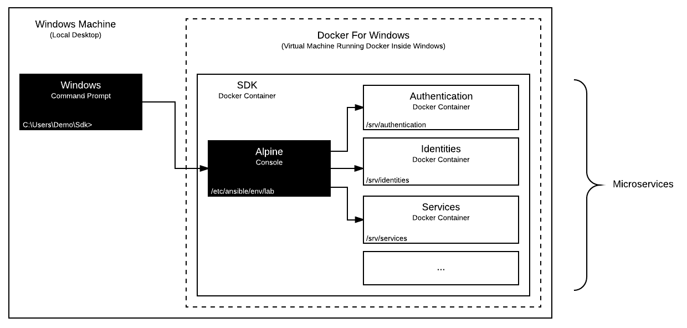

# Lab Environment

The lab environment is typically deployed to your local machine and is used to further develop the platform.

It represents the experimental branch of the DigitalState platform and enables the developer to run the latest source code on a local machine as a dockerized application.

## Table of Contents

- [Synopsis](#synopsis)
- [Deployment](#deployment)
- [Explore](#explore)

## Synopsis

1. **[Install Git and Docker on your local machine.](#1-install-git-and-docker-on-your-local-machine)**
2. **[Download the platform repository.](#2-download-the-platform-repository)**
3. **[Boot the platform container.](#3-boot-the-platform-container)**
4. **[Enter the platform container console.](#4-enter-the-platform-container-console)**
5. **[Configure the Ansible environment.](#6-configure-the-ansible-environment)**
6. **[Add DNS entries to your host file.](#7-add-dns-entries-to-your-host-file)**
7. **[Run the install command with Ansible.](#8-run-the-install-command-with-ansible)**

## Deployment

### 1. Install Git and Docker on your local machine

To begin, you will need to install Git (for [Windows](https://git-scm.com/book/en/v2/Getting-Started-Installing-Git#_installing_on_windows), for [Mac](https://git-scm.com/book/en/v2/Getting-Started-Installing-Git#_installing_on_mac), for [Linux](https://git-scm.com/book/en/v2/Getting-Started-Installing-Git#_installing_on_linux)) and Docker (for [Windows](https://www.docker.com/docker-windows), for [Mac](https://docs.docker.com/docker-for-mac), for [Linux](https://docs.docker.com/engine/installation/#server)) on your local machine.

> Note: Docker Toolbox for Windows and Mac is not compatible.

### 2. Download the platform repository

Open a command prompt and download the repository:

```
> cd C:\Users\Demo
> git clone https://github.com/DigitalState/Platform.git
> cd Platform
```

### 3. Boot the platform container

Run the following command to boot the platform container:

```
> docker-compose up -d
```

> Note: Docker may prompt you to share your drive (for Docker volumes).

Confirm the container has been booted successfully:

```
> docker ps
```

You should see the following output:

```
CONTAINER ID     IMAGE                 COMMAND       CREATED           STATUS           PORTS     NAMES
4ceab8511b85     platform_platform     "/bin/sh"     3 seconds ago     Up 2 seconds               platform
```

### 4. Enter the platform container console

Run the following command to enter the platform container console:

```
> docker exec -it platform /bin/sh
```

Point to the lab environment directory:

```
$ cd /etc/ansible/env/lab
```

At this point, you have the platform container running on your local machine as a bare Linux Alpine system with Ansible pre-installed and ready to accept commands.

### 5. Configure the Ansible environment

Configure the Ansible lab environment:

> The lab environment uses the Ansible inventory file found [here](/platform/ansible/env/lab/inventory.yml) for its configurations.

The [encryption.secret](https://github.com/DigitalState/Platform/blob/master/platform/ansible/env/lab/inventory.yml#L16) config needs to be set to a random, unique and secret 32 characters string.

The [jwt.pass_phrase](https://github.com/DigitalState/Platform/blob/master/platform/ansible/env/lab/inventory.yml#L18) config needs to be set to the jwt key pass phrase defined at step #5.

The [directory](https://github.com/DigitalState/Platform/blob/master/platform/ansible/env/lab/inventory.yml#L12) config needs to be set to the absolute path of the platform `app` directory. The value will vary depending on your local machine's operating system:

**Windows**

Under Docker for Windows with Hyper-V, the value should be equal to the Hyper-V mounted directory path. For example, if you have put the platform repository at `C:\Users\Demo\Platform`, then the directory config value should be `/c/Users/Demo/Platform/app`.

**Mac**

Under Docker for Mac, the value should simply be equal to the normal directory path, as long as you have shared the local `/Users` directory with the virtual machine. For example, if you have put the platform repository at `/Users/demo/platform`, then the directory config value should be `/Users/demo/platform/app`.

**Linux**

Under operating systems that supports Docker natively, the value should simply be equal to the normal directory path. For example, if you have put the platform repository at `/home/demo/platform`, then the directory config value should be `/home/demo/platform/app`.

### 6. Add DNS entries to your host file

Add DNS entries to your host file:

> The lab environment uses a local dns under *.lab.ds.

Locate the host file on your local machine.

**Windows**

Under Windows, the file is located at `C:\Windows\System32\drivers\etc\host`.

**Mac**

Under Mac, the file is located at `/etc/hosts`.

**Linux**

Under Linux, the file is located at `/etc/hosts`.

Add the following entries:

```
127.0.0.1 admin.lab.ds
127.0.0.1 portal.lab.ds
127.0.0.1 api.assets.lab.ds
127.0.0.1 api.authentication.lab.ds
127.0.0.1 api.camunda.lab.ds
127.0.0.1 api.cases.lab.ds
127.0.0.1 api.cms.lab.ds
127.0.0.1 api.discovery.lab.ds
127.0.0.1 api.formio.lab.ds
127.0.0.1 api.identities.lab.ds
127.0.0.1 api.services.lab.ds
127.0.0.1 api.records.lab.ds
```

### 7. Run the install command with Ansible

Install the dockerized application locally with the Ansible install command:

```
ansible-playbook ./install.yml
```

This command downloads repositories, configures settings, builds Docker images, boots up containers, migrates databases and loads data fixtures for each microservice.

> Note: Depending on the power of your machine and internet speed, this command may take a while to finish.

## Explore

Now that the dockerized application is up and running, it is time to test it!



- Portal UI: http://portal.lab.ds/ (Username: morgan@individual.ds / Password: morgan)
- Admin UI: http://admin.lab.ds/ (admin@staff.ds / admin)
- Formio: http://api.formio.lab.ds/ (admin@staff.ds / admin)
- Camunda: http://api.camunda.lab.ds/camunda
- Postman: [collection](/resource/postman/collection.json) / [environment](/resource/postman/env/lab.json)

> The DigitalState architecture is essentially a collection of business-focused microservices, all exposing various APIs to create, read, update, and delete data or achieve certain goals.

In order to interact with the API, we suggest using an API gui tool, such as [Postman](https://www.getpostman.com/) (use the desktop version, and **not** the Chrome version). The platform provides a pre-made Postman [collection file](../../../resource/postman/collection.json) mapping all microservices API endpoints and an [environment file](../../../resource/postman/env/lab.json) ready to be imported. Here are the instructions on how to import [collections](https://www.getpostman.com/docs/postman/collections/creating_collections) and [environments](https://www.getpostman.com/docs/postman/environments_and_globals/manage_environments) in Postman.

After importing the files, a new collection titled "DigitalState" will appear on the left and a new environment titled "DigitalState Lab" will appear in the dropdown top right.

As a first test, we will **login** as a Staff user and **query** the list of users in the system.

> The application comes with data fixtures that are loaded on first deploy as demo data. These data fixtures includes a few Business Units, Staff and Individual users, among other things.

Under the "DigitalState" collection, navigate to `Authentication -> Login -> /tokens/staff`. Also, select the "DigitalState Lab" environment. Click the "Send" button. This action simulates a login by sending pre-configured user credentials to the authentication microservice and return a jwt token on success:

```
{
    "token": "abc..."
}
```

Once a token is obtained, it can be used to access any other protected API endpoints that requires user authentication. Typically, you would need to copy this token to your clipboard and paste it in the next API query you wish to make in Postman. However, our Postman collection has been programmed to keep track of the last logged in user and use the current token on subsequent API requests automatically.

Next, nagivate to `Authentication -> User -> GET /users`. Click the "Send" button. This action will send a GET request to users API endpoint and return a list of users:

```
[
    {
        "id": 1,
        ...
    },
    {
        "id": 2,
        ...
    },
    ...
]
```
