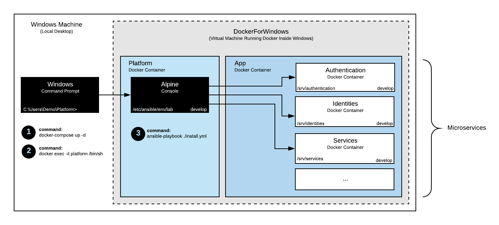

# Lab Environment

The lab environment is typically deployed to your local machine and is used to further develop the application.

It represents the experimental branch of the DigitalState application and enables the developer to run the latest source code on a local machine as a dockerized application.

:warning: _This environment is only compatible with the develop branch of the platform repository._

## Table of Contents

- [Synopsis](#synopsis)
- [Deployment](#deployment)
- [Architecture](#architecture)
- [Explore](#explore)

## Synopsis

1. [Install Git and Docker on your local machine.](#1-install-git-and-docker-on-your-local-machine)
2. [Download the platform repository.](#2-download-the-platform-repository)
3. [Boot the platform container.](#3-boot-the-platform-container)
4. [Enter the platform container console.](#4-enter-the-platform-container-console)
5. [Run the install command with Ansible.](#5-run-the-install-command-using-ansible)
6. [Add DNS entries to your host file.](#6-add-dns-entries-to-your-host-file)

## Deployment

### 1. Install Git and Docker on your local machine

To begin, you will need to install Git (for [Windows](https://git-scm.com/book/en/v2/Getting-Started-Installing-Git#_installing_on_windows), for [Mac](https://git-scm.com/book/en/v2/Getting-Started-Installing-Git#_installing_on_mac), for [Linux](https://git-scm.com/book/en/v2/Getting-Started-Installing-Git#_installing_on_linux)) and Docker (for [Windows](https://www.docker.com/docker-windows), for [Mac](https://docs.docker.com/docker-for-mac), for [Linux](https://docs.docker.com/engine/installation/#server)) on your local machine.

> Note: Docker Toolbox for Windows and Mac is not compatible.

> Note: If you are on Windows, Windows Pro with HyperV is required.

### 2. Download the platform repository

Open a console and download the repository:

```
> cd C:\Users\Demo
> git clone https://github.com/DigitalState/Platform.git
> cd Platform
```

### 3. Boot the platform container

Run the following command to boot the platform container:

```
> docker-compose up -d
```

> Note: Docker may prompt you to share your drive (for Docker volumes).

Run the following command to confirm the container has been booted successfully:

```
> docker ps
```

You should see the following output:

```
CONTAINER ID   IMAGE               COMMAND               CREATED         STATUS         PORTS    NAMES
4ceab8511b85   platform_platform   "/bin/sh"             3 seconds ago   Up 2 seconds            platform
e9aa40751206   platform_app        "/usr/sbin/sshd -D"   3 seconds ago   Up 2 seconds   22/tcp   app
```

> Note: There is also an app container being created. This container is used to hold the deployed application instance when running the lab environment.

### 4. Enter the platform container console

Run the following command to enter the platform container console:

```
> docker exec -it platform /bin/sh
```

Point to the lab environment directory:

```
$ cd /etc/ansible/env/lab
```

At this point, you have the platform container running on your local machine as a bare Linux Alpine system with Ansible pre-configured and ready to run playbooks.

### 5. Run the install playbook using Ansible

Run the following command to install the dockerized application:

```
ansible-playbook ./install.yml
```

> Note: Depending on the power of your machine and internet speed, this command may take a while to finish.

This playbook deploys the DigitalState application to the app container. It consists of downloading repositories, setting configurations, booting up containers, migrating databases and warming up caches for each microservice.

### 6. Add DNS entries to your host file

Locate the host file on your local machine. Under **Windows**, the file is located at `C:\Windows\System32\drivers\etc\host`. Under **Mac** or **Linux**, the file is located at `/etc/hosts`.

Add the following entries:

```
127.0.0.1 admin.lab.ds
127.0.0.1 portal.lab.ds
127.0.0.1 api.assets.lab.ds
127.0.0.1 ui.database.assets.lab.ds
127.0.0.1 ui.cache.assets.lab.ds
127.0.0.1 api.authentication.lab.ds
127.0.0.1 ui.database.authentication.lab.ds
127.0.0.1 ui.cache.authentication.lab.ds
127.0.0.1 api.camunda.lab.ds
127.0.0.1 api.cases.lab.ds
127.0.0.1 ui.database.cases.lab.ds
127.0.0.1 ui.cache.cases.lab.ds
127.0.0.1 api.cms.lab.ds
127.0.0.1 ui.database.cms.lab.ds
127.0.0.1 ui.cache.cms.lab.ds
127.0.0.1 api.discovery.lab.ds
127.0.0.1 ui.discovery.lab.ds
127.0.0.1 api.formio.lab.ds
127.0.0.1 ui.database.formio.lab.ds
127.0.0.1 api.forms.lab.ds
127.0.0.1 ui.database.forms.lab.ds
127.0.0.1 ui.cache.forms.lab.ds
127.0.0.1 api.identities.lab.ds
127.0.0.1 ui.database.identities.lab.ds
127.0.0.1 ui.cache.identities.lab.ds
127.0.0.1 api.services.lab.ds
127.0.0.1 ui.database.services.lab.ds
127.0.0.1 ui.cache.services.lab.ds
127.0.0.1 api.records.lab.ds
127.0.0.1 ui.database.records.lab.ds
127.0.0.1 ui.cache.records.lab.ds
```

## Architecture

The lab environment involves two containers: **platform** and **app**. The platform container is an Alpine-based linux container with **Ansible** pre-configured with a wide variety of pre-programmed playbooks. The app container is an Alpine-based linux container with a **SSH** server pre-configured, ready to host the application.

Essentially, the platform container is used by the developer to issue Ansible orchestration commands to the app container.

> Note: The app container is only used during development. It enables the developer to host the app on a local machine. In a production environment, the app container would be replaced by a host machine or a docker container manager, such as [Rancher](https://github.com/rancher/rancher).

Below is a diagram displaying the gist of the lab environment.



## Explore

Now that the dockerized application is up and running, it is time to test it!

### Portal

The Portal SPA is a public website used by citizens to access their account and explore services.

- **Url:** http://portal.lab.ds/
- **Username:** morgan@individual.ds
- **Password:** morgan

### Admin

The Admin SPA is a private website used by staff members to manage the backoffice.

- **Url:** http://admin.lab.ds/
- **Username:** admin@staff.ds
- **Password:** admin

### Formio

The Formio SPA is a private website used by staff members to manage forms.

- **Url:** http://api.formio.lab.ds/
- **Username:** admin@staff.ds
- **Password:** admin

### Camunda

The Camunda SPA is a private website used by staff members to manage workflows.

- **Url:** http://api.camunda.lab.ds/camunda

### Api

The Api is fully mapped through a Postman [collection](/app/documentation/postman/collection.json) and [environment](/app/documentation/postman/env/lab.json) file.

There is also a [tutorial available](/platform/documentation/tutorials/postman.md) on getting started with Postman.