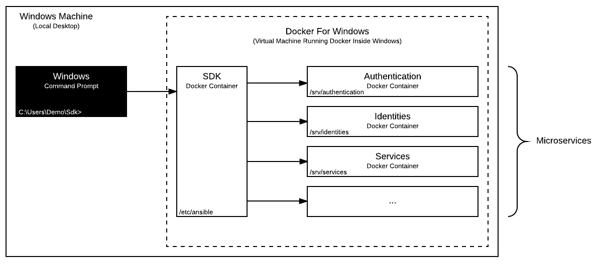

# Lab Environment

The lab environment enables the developer to run the DigitalState platform on a local machine as a dockerized application.

It also provides useful bulk commands to help during development.

## Table of Contents

- [Synopsis](#synopsis)
- [Installation](#installation)
- [Configuration](#configuration)
- [Deployment](#deployment)
- [Test](#test)
- [References](#references)

## Synopsis

1. **Install** the SDK on your local machine.
2. **Configure** the Ansible lab environment.
3. **Generate** keys for the system.
4. **Add** entries to your host file.
5. **Deploy** the dockerized application locally.
6. **Test** the application.

## Installation

1. To begin, you will need to install Docker (for [Windows](https://www.docker.com/docker-windows), for [Mac](https://docs.docker.com/docker-for-mac), for [Linux](https://docs.docker.com/engine/installation/#server)) on your local machine.

2. Download this repository.

3. Open a console and make it point to the root of the repository directory:

   ```
      cd C:\Users\Demo\Sdk
   ```

4. Boot the SDK container:

   ```
   docker-compose up -d
   ```

5. Confirm the container has been booted successfully:

   ```
   docker ps
   ```
   
   You should see the following output:
   
   ```
   CONTAINER ID        IMAGE               COMMAND             CREATED             STATUS              PORTS               NAMES
   4ceab8511b85        sdk_sdk             "/bin/sh"           3 seconds ago       Up 2 seconds                            sdk
   ```

6. Enter the container in console mode:

   ```
   docker exec -it sdk /bin/sh
   ```

At this point, you have the SDK container running on your local machine as a bare Linux Alpine system with Ansible pre-installed and ready to accept commands. 

## Configuration

Prior to deploying the application, a few actions are required by the developer:

1. Configure the Ansible lab environment.

    > The lab environment uses an Ansible inventory file found [here](/sdk/ansible/env/lab/inventory.yml) for its configurations.

    The [directory](https://github.com/DigitalState/Sdk/blob/master/sdk/ansible/env/lab/inventory.yml#L11) config needs to be set to the absolute path of the SDK app directory. The value will vary depending on your local machine's operating system:

    **Windows**

    Under Docker for Windows with Hyper-V, the value should be equal to the Hyper-V mounted directory path.

    For example, if you have put the SDK repository at `C:\Users\Demo\Sdk`, then the directory config value should be `/c/Users/Demo/Sdk/app`.

    **Mac**

    Under Docker for Mac...

    **Linux**

    Under operating systems that supports Docker natively, the value should simply be equal to the normal directory path.

    For example, if you have put the SDK repository at `/home/demo/sdk`, then the directory config value should be `/home/demo/sdk/app`.

2. Generate keys for the system.

    > The DigitalState architecture uses [jwt](https://jwt.io/introduction/) tokens for user authentication. 
    > The authentication system requires a private and public key to generate and validate tokens. 
    > Jwt keys should be unique to each projects and are not included in this repository for security reasons. 

    To create jwt keys, follow the instructions [for Windows](https://www.ssh.com/ssh/putty/windows/puttygen), [for Mac](#) or [for Linux](https://www.ssh.com/ssh/putty/linux/puttygen). Once created, copy the key files over to the jwt resource directory.
 
    The private key should be copied to `C:\Users\Demo\Sdk\resource\jwt\lab\key`.

    The public key should be copied to `C:\Users\Demo\Sdk\resource\jwt\lab\key.pub`. 

3. Add entries to your host file.

    > The lab environment uses an internal DNS.
    
    Locate the host file on your local machine and add the following entries:
    
    ```
    127.0.0.1 admin.lab.ds
    127.0.0.1 portal.lab.ds
    127.0.0.1 api.assets.lab.ds
    127.0.0.1 api.authentication.lab.ds
    127.0.0.1 api.camunda.lab.ds
    127.0.0.1 api.cases.lab.ds
    127.0.0.1 api.cms.lab.ds
    127.0.0.1 api.formio.lab.ds
    127.0.0.1 api.identities.lab.ds
    127.0.0.1 api.services.lab.ds
    127.0.0.1 api.records.lab.ds
    127.0.0.1 api.tasks.lab.ds
    ```

## Deployment

From the SDK console, point to the lab environment directory and execute the deploy Ansible command:

```
cd /etc/ansible/env/lab
ansible-playbook deploy.yml
```

This command essentially downloads repositories, configures settings, builds images, boots up containers, migrates databases and loads data fixtures for each microservices.



## Test

Now that the dockerized application is up and running, it is time to test it!

> The DigitalState architecture is essentially a collection of microservices, all exposing various api endpoints to create, edit, delete certain data or achieve certain goals. 

In order to test, we suggest using an api gui tool, such as [Postman](https://www.getpostman.com/). The SDK provides a pre-made Postman [collection file](../../../resource/postman/collection.json) mapping all microservices api endpoints and an [environment file](../../../resource/postman/env/lab.json) ready to be imported. Here are the instructions on how to import [collections](https://www.getpostman.com/docs/postman/collections/creating_collections) and [environments](https://www.getpostman.com/docs/postman/environments_and_globals/manage_environments) in Postman.

After importing the files, a new collection titled "DigitalState" will appear on the left and a new environment titled "DigitalState Lab" will appear in the dropdown top right.

As a first test, we will **login** as a Staff user and **query** the list of users in the system.

> The application comes with data fixtures that are loaded on first deploy as demo data. These data fixtures includes a few Business Units, Staff and Individual users, among other things.

Under the "DigitalState" collection, navigate to `Authentication -> Login -> /tokens/staff`. Also, select the "DigitalState Lab" environment. Click the "Send" button. This action simulates a login by sending pre-configured user credentials to the authentication microservice and return a jwt token on success:

```
{
    "token": "abc..."
}
```

Once a token is obtained, it can be used to access any other protected api endpoints that requires user authentication. Typically, you would need to copy this token to your clipboard and paste it in the next api query you wish to make in Postman. However, our Postman collection has been programmed to keep track of the last logged in user and use the current token on subsequent api requests automatically.

Next, nagivate to `Authentication -> User -> /users`. Click the "Send" button. This action will send a GET request to users api endpoint and return a list of users:

```
[
    {
        "id": 1,
        ...
    },
    {
        "id": 2,
        ...
    },
    ...
]
```

## References

- [List of available Ansible commands.](commands.md)
- [Inventory configuration file explained.](configurations.md)
